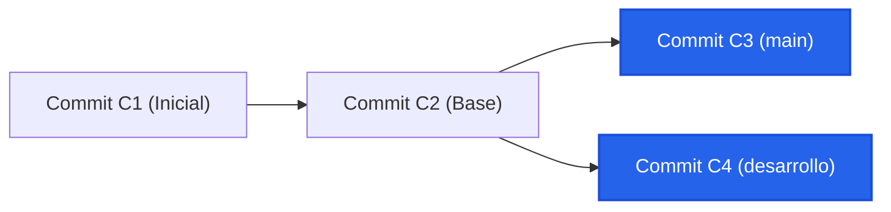
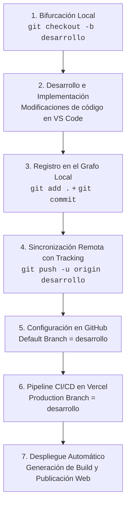

# Memoria Técnica: Gestión de Ramas y Despliegue Continuo (CI/CD)

**Módulo Profesional:** Desarrollo de Interfaces (Código: 0488)  
**Ciclo Formativo:** Desarrollo de Aplicaciones Multiplataforma / Web (DAM / DAW)  
**Alumno:** Alejandro  
**Repositorio GitHub:** [https://github.com/alex060/usersApp](https://github.com/alex060/usersApp)  
**Despliegue en Producción (Vercel):** [https://users-app-brown.vercel.app](https://users-app-brown.vercel.app)  

---

## 1. Contexto Curricular y Objetivos

* **Resultado de Aprendizaje 7 (RA 7):** Distribución y empaquetado de aplicaciones.
* **Criterio de Evaluación 7.c (CE 7.c):** Se han utilizado herramientas de control de versiones.
* **Criterio de Evaluación 7.g (CE 7.g):** Se han documentado las fases del proceso de distribución y despliegue continuo (CI/CD).

El objetivo de esta práctica es implementar un ciclo de integración y entrega continua (CI/CD) profesional utilizando **Git**, **GitHub** y **Vercel**, aplicando buenas prácticas de control de versiones mediante ramificación (branching) y despliegue automatizado en entornos diferenciados.

---

## 2. Base Teórica Técnica: Git y el Grafo Dirigido Acíclico (DAG)

### 2.1. El Grafo Dirigido Acíclico (DAG)
Git no almacena copias de archivos modificados ni listas de diferencias (deltas) tradicionales, sino que gestiona el estado del proyecto como un **Grafo Dirigido Acíclico** (DAG - *Directed Acyclic Graph*):
* **Nodos (Commits):** Cada commit es un objeto inmutable identificado por una suma criptográfica (hash SHA-1 o SHA-256).
* **Estructura del Commit:** Contiene un puntero hacia el árbol raíz de archivos (`tree`), metadatos del autor, fecha, mensaje y punteros a sus commits ascendentes (padres).
* **Acíclico y Dirigido:** La información solo viaja en una dirección (hacia los commits anteriores en el tiempo), haciendo imposible la existencia de bucles o modificaciones retroactivas sin alterar todos los hashes posteriores.



### 2.2. Naturaleza de las Ramas (Branches)
En Git, una rama **no es una carpeta física ni una copia de los archivos**. Una rama es simplemente un archivo plano de **41 bytes** en `.git/refs/heads/` que almacena un puntero (hash de 40 caracteres más un salto de línea) al commit más reciente de esa línea temporal.
* Al crear la rama `desarrollo`, se crea un nuevo puntero referenciando al mismo nodo actual.
* Al generar un nuevo commit en `desarrollo`, únicamente se desplaza ese puntero hacia adelante, mientras el puntero de `main` permanece intacto.

### 2.3. Remotos (`git remote`)
Los remotos son alias semánticos (por convención `origin`) que apuntan a la URL de un servidor externo (como GitHub). El archivo de configuración local `.git/config` asocia dicho alias para que los comandos de sincronización (`git push` y `git fetch`) sepan exactamente a qué destino transferir los objetos del DAG que faltan.

---

## 3. Fases del Proceso de CI/CD Documentadas (CE 7.g)

El ciclo de distribución continua se organiza en las siguientes fases:



---

## 4. Registro y Justificación de Comandos Técnicos (Paso a Paso)

### Fase 1: Creación de la rama `desarrollo`
* **Comando:**
  ```bash
  git checkout -b desarrollo
  ```
* **Justificación Técnica:**  
  Crea simultáneamente el nuevo puntero de rama `desarrollo` y actualiza la referencia `HEAD` para apuntar a ella, aislando cualquier desarrollo posterior de la rama principal `main`.

### Fase 2: Implementación de cambios de código
* **Modificación realizada:**  
  En el archivo `src/app/pages/users/users.page.html`, se modifica el título de la barra de navegación:
  ```html
  <ion-title>Usuarios Activos (Desarrollo)</ion-title>
  ```
* **Justificación Técnica:**  
  Introducir un cambio visual tangible que permita verificar externamente si el pipeline de Vercel está desplegando la rama correcta.

### Fase 3: Registro en el Grafo (Staging y Commit)
* **Comandos:**
  ```bash
  git add .
  git commit -m "feat: modificaciones iniciales para entorno de desarrollo"
  ```
* **Justificación Técnica:**  
  * `git add .`: Prepara los archivos modificados en el área de ensayo (*Index / Staging Area*).
  * `git commit`: Genera un nuevo nodo inmutable en el DAG con su hash correspondiente, actualizando el puntero `desarrollo`.

### Fase 4: Subida al Repositorio Remoto con Upstream Tracking
* **Comando:**
  ```bash
  git push -u origin desarrollo
  ```
* **Justificación Técnica del flag `-u` (`--set-upstream`):**  
  Este flag es fundamental en el primer push de una rama. Establece un vínculo de seguimiento (*tracking branch*) entre la rama local `desarrollo` y la rama remota `origin/desarrollo` en `.git/config`. Gracias a esto, cualquier operación futura de `git pull` o `git push` no requerirá especificar origen ni rama.

---

## 5. Configuración de Plataformas (GitHub y Vercel)

### 5.1. Establecer `desarrollo` como rama por defecto en GitHub
1. Acceder al repositorio: `https://github.com/alex060/usersApp/settings`.
2. En la barra lateral izquierda, ingresar a **Default branch** (sección *Code and automation*).
3. Pulsar sobre el botón con el icono de flechas cruzadas (**Switch default branch**).
4. Seleccionar la rama `desarrollo` y hacer clic en **Update** confirmando la acción.

### 5.2. Sobrescritura de la Rama de Producción en Vercel
Por estándar, Vercel enlaza los despliegues de producción a la rama por defecto de GitHub (`main`). Para canalizar el despliegue a través del entorno de desarrollo:
1. En el panel de control de Vercel del proyecto `users-app`, entrar en **Settings** -> **Git**.
2. Localizar el apartado **Production Branch**.
3. Cambiar el valor por defecto por `desarrollo` y pulsar **Save**.
4. A partir de este instante:
   * Los commits subidos a `desarrollo` activan automáticamente el pipeline de compilación (`npm run build`) para **Producción**.
   * Cualquier otra rama generará despliegues aislados de previsualización (*Preview Deployments*).

---

## 6. Verificación y Resultados

* **Estado de la Rama:** La rama `desarrollo` es la rama activa y por defecto del repositorio.
* **Resultado CI/CD:** El despliegue en Vercel se ejecuta en cada push sin intervención manual.
* **URL de Producción Activa:** [https://users-app-brown.vercel.app](https://users-app-brown.vercel.app)
